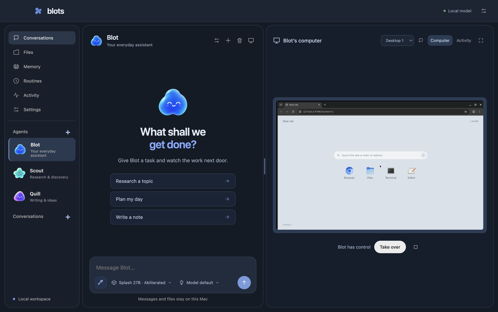

# Blots

**Your own little team.** A charcoal local AI desktop app with blue accents, built for Apple silicon Macs. Each bot has its own persistent Linux computer. The agent conversation is the main reading area, with a live Linux computer beside it. Extra desktops are available in the compact screen picker. Drag the divider to resize the computer pane, use arrow keys when the divider is focused, or double-click it to reset the split. Pane width is saved locally between launches. Expand the computer to watch more closely or take over its mouse and keyboard.

Blots is independently built software, not a fork of Bops. There is no Blots account, inference subscription, telemetry, or hosted backend. Inference and app data stay on your Mac. Web research connects to the websites you ask your bots to visit.



## Run on your Mac

1. Install Docker Desktop once. Blots starts it quietly in the background when a Linux desktop or image build needs it; you do not have to launch it manually. No Docker account is required to run local containers. If Docker needs first-run setup or another confirmation, open it to complete that step.
2. Run an OpenAI-compatible **local model server** with a tool-capable model loaded. Blots defaults to `http://127.0.0.1:8000/v1`. The app selects the first available model on first launch; change it in Settings. Ollama commonly uses `http://127.0.0.1:11434/v1`; LM Studio commonly uses `http://127.0.0.1:1234/v1`.
3. Open **Blots.app**. Click **Start computer** beside your bot. On a fresh machine, first choose **Settings → Build computer image**. This downloads and builds the Linux desktop once; subsequent starts use the local image.
4. Use the composer’s shield icon to choose **Ask** or **Auto** approval. Auto saves standing approval for the selected bot’s Linux commands, browser, mouse, keyboard, and shared workspace file writes. It defaults to Ask. Switching to Auto also approves a waiting Linux action; switching back to Ask restores prompts for subsequent actions. Mac system access is not added. The cube icon selects a local model, and the lightbulb selects reasoning. The reasoning menu offers Model default, Off, Low, Medium, and High for the two verified Qwen3.8 Splash packages; High sends their `xhigh` setting. Splash 35B A3B offers Model default (thinking on) and Off; its reasoning is a switch rather than graded levels. Unverified models use their own default with the picker disabled. Switching models resets reasoning, and each task keeps the choices made when it was sent.
5. Ask a bot to research a topic, draft a document, or organize files. Review requested writes and browser interactions. Click **Take over** to drive its real desktop; **Hand back** or Escape returns control.

Desktop limits apply on the next desktop start, including existing computers; their files and profiles remain. These are per-desktop ceilings, separate from Docker’s shared Linux VM and the inference server. Three desktops share the VM rather than booting three independent VMs. See [browsing runtime and resource checks](docs/browser-runtime.md).

The supplied Mac app bundles its own Electron/Node runtime. You do not need Node to launch it. Docker Desktop and the local inference server are separate prerequisites; model weights are not included.

## Splash abliterated

The selected model on the development Mac is [`audreyt/Qwen3.8-27B-Splash-abliterated`](https://huggingface.co/audreyt/Qwen3.8-27B-Splash-abliterated), a Splash-specific package. It is not an Ollama/GGUF model. Install the Splash runtime, then serve it locally:

```sh
brew install incoai/tap/splash
splash serve --model audreyt/Qwen3.8-27B-Splash-abliterated
```

Select that model in Blots Settings and enable visual desktop tools. The model is about 17.4 GB to download; the model card specifies Apple M3 or newer and at least 36 GB unified memory. Model quality can be weaker than the original, so the original remains available on the development Mac. Its existing local gateway selects the requested Splash model and coordinates Splash/Sushi so only one model is resident, with idle offload after five minutes. A fresh machine can use the direct command above instead.

## Build from source

Requirements: an Apple silicon Mac, Node 22+, npm, Docker Desktop, and a local model server supporting `/v1/models`, `/v1/chat/completions`, streaming, and function calls.

```sh
git clone https://github.com/anujk22/blots.git
cd blots
npm ci
npm run computer:build
npm start
```

For the native app:

```sh
npm run build
open dist/mac-arm64/Blots.app
```

For browser-based development: `npm run dev`, then open `http://127.0.0.1:4317`. The packaged desktop chooses an available loopback port automatically.

The desktop is built locally and unsigned for distribution; it is not a notarized App Store release.

## What works

- Multiple named bots with editable roles, instructions, and colors. Bots can delegate tasks to teammates; delegated tasks appear in their own conversations and use the same local inference queue.
- Persistent conversations with streamed local model responses.
- Live web search, real browser navigation, page reading, and numbered browser actions. Research bots can open sources and cite URLs; no paid search API is needed.
- A real 1280 × 960 Linux computer per bot, with an inset Chromium browser, an agent-colored welcome screen, clock, portrait, patterned background, and a native browser/terminal/files dock. The five-column app grid launches installed tools including Blender, Draw, FreeCAD, GIMP, Godot, Inkscape, Kdenlive, KiCad, Mousepad, OpenSCAD, ParaView, QGIS, and Solitaire. Four independent desktops are available through a compact picker, with persistent browser profiles and home directories.
- Live VNC viewing, expansion, and mouse/keyboard takeover, with a wider conversation pane and the composer below the conversation. Agent tools wait while you have control of their screen.
- Local workspace listing, reading, file creation/editing, and downloads. Saved memories and new scheduled tasks come to you for review. Workspace file writes, browser actions, and Linux actions also ask unless Auto is enabled for that bot.
- Durable local memory shared among bots, managed by you.
- Scheduled routines, created in the app or requested in chat, while the app is open. Results appear in their own conversations; reviewed actions still wait for you.
- Tool activity, cancellation, saved task continuation, data export, and local server/model settings. Long tasks default to 120 model turns or 120 minutes per session, with configurable budgets. Continue task restores saved progress after a pause or app restart.
- Visible real mouse motion, clicking, hovering, scrolling, typing and key presses in Linux. Browser clicks and text entry use the actual desktop pointer too. The pointer is embedded in the live video so viewers can watch the work.
- Computer tasks run visibly in Linux. Web research favors the browser tools and accurate page text, using screenshots when needed for a blocked page or unclear control. Searches and page opens use the real address bar, mouse and keyboard. Native apps prefer screenshot-guided GUI actions. Ordinary questions can still receive direct answers. The native cursor has an agent-colored glow and portrait badge, with eased motion timed at 60 updates per second.
- Three compact composer menus choose action approval, the local model, and the model's supported reasoning level. Hover labels show the current choices. Computer tools remain available; the agent decides when a question needs computer work.
- Optional screenshot-based native app tools for **vision-capable** local models. Enable these in Settings. Ordinary browser research uses page text and works without vision.

## Tuned for Apple silicon

The Mac app and Linux image run natively on ARM64. Models run in your existing local server, not in Docker. Blots serializes model requests while different bots run computer actions concurrently. Turns for the same bot remain ordered so they cannot fight over its pointer. Only the first screen starts with a computer; the other three start when viewed or used. Each desktop defaults to a 1-CPU, 1-GiB limit, with Settings sliders for 1–4 CPUs and 1–4 GiB; at most three run at once. With one active screen each, three idle computers measured about 1.0 GiB combined on the development M5 Pro Mac, down from 3.5 GiB when every screen started eagerly. Opening additional screens or heavy applications increases usage. The model server and Docker VM have separate overhead. Computers start on demand and stop together when Blots quits; their data persists. Hidden viewers disconnect without stopping agent work. Browser HTTP caches are limited to 64 MiB per used screen; container logs rotate at 10 MiB. Only the latest screenshot batch is sent in later vision turns. Unchanged state polls return no body, and saved state uses compact JSON. The full Linux application image is shared by all bots; it is not copied for each computer.

Conversation context is bounded to the most recent 24 messages and 60,000 characters. Tool results are bounded and reply length is configurable. During tasks, context is summarized under token pressure against a configurable 65,536-token default budget, reserving room for output and tool/screenshot growth. Reported token usage and a text-size estimate inform the trigger; it is not an exact preflight token count. There is no fixed-turn compaction. The original goal, factual progress, and two recent tool rounds remain. Thinking is retained between tool calls and in paused checkpoints; older thinking is removed when it is included in a pressure-triggered summary. The output budget includes thinking and the visible reply, defaults to 16,384 tokens, and can be raised to 65,536. Only current screenshots are kept in memory; checkpoint files contain text, not image histories. This avoids uncontrolled context growth; it also means very long conversations do not all fit in a single prompt. Shared memory preserves the facts you choose to save.

## Your data and boundaries

The packaged Mac app stores data in:

```text
~/Library/Application Support/Blots/
├── state.json             conversations, settings, memory, routines, activity
├── workspace/             shared files visible to you and your bots
├── tasks/<run-id>.json    text checkpoints for paused or interrupted tasks
└── computers/<bot-id>/    each computer's persistent Linux home and profiles
```

No Mac home directory, model API key, Docker socket, or system folder is mounted into a bot computer. The only Mac mounts are its own home storage and the shared Blots workspace. Linux commands run as an unprivileged user inside the computer. Workspace tools reject traversal and symlink escapes. Computers share the workspace intentionally.

The app server, desktop ports, and model connection are loopback-only. The app checks request origins and hosts; the renderer is sandboxed with Node disabled. Markdown is sanitized. API keys, when a local server needs one, stay in local settings and are excluded from exported backups. This is a single-user local app, not a multi-user remote service.

Quitting stops pending work. Reopening records interrupted tasks instead of repeating them automatically. Stopping prevents further model/tool steps; an already executing Linux command may finish or reach its 30-second limit. The default session pauses after 120 decision turns or two hours; Settings supports up to 1,000 turns and eight hours. Continue task retains the original goal and recorded results, obtains a fresh desktop screenshot when visual tools are enabled, and preserves denied actions. Four consecutive identical action-and-result rounds pause the task to avoid a simple loop. This does not detect every possible loop. Completed checkpoint files are removed and activity is bounded. See [long-task verification and model limits](docs/long-tasks.md).

## Practical limits

Local model quality determines reasoning, tool selection, vision, and task success. Blots does not claim parity with proprietary frontier models. Websites can require sign-in, present CAPTCHAs, or restrict automation; take over when they need you. Search uses ordinary websites and remains subject to their availability. Voice calls, phone numbers, email provisioning, paid connector catalogs, and controlling arbitrary Mac apps are not included. Routines do not run while Blots or the Mac is off.

The Linux computers are containers inside Docker Desktop's local Linux VM, not separate hardware VMs. The code is MIT licensed; dependencies retain their own licenses, including noVNC's MPL-2.0 license.

## Verification

```sh
npm test
npm audit --omit=dev
```

Automated tests cover local-only inference routing, file confinement, fragmented streams, approval before execution, denial/cancellation, persistence, exports without credentials, inference queuing, and takeover pause/hand-back. The app also underwent live UI and Docker checks plus actual local-model file creation, source-reading, vision, real-pointer browser clicks/typing, and cursor visibility checks. Artwork was created with GPT Images; see [artwork details](docs/artwork.md).
